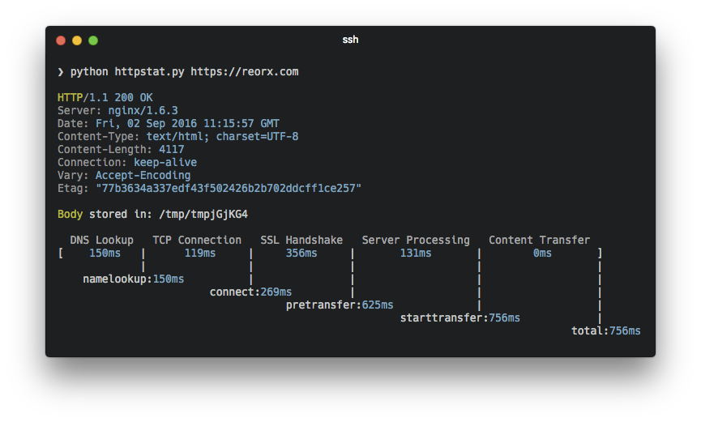

# httpstat



httpstat visualizes `curl(1)` statistics in a way of beauty and clarity.

It is a **single file🌟** Python script that has **no dependency👏** and is compatible with **Python 3🍻**.


## Installation

There are three ways to get `httpstat`:

- Download the script directly: `wget https://raw.githubusercontent.com/reorx/httpstat/master/httpstat.py`

- Through pip: `pip install httpstat`

- Through homebrew (macOS only): `brew install httpstat`


## Usage

Just pass a url with it:

```bash
python httpstat.py httpbin.org/get
```

> If installed through pip or brew, you can use `httpstat` as a command instead of `python httpstat.py`.

By default it will write response body in a tempfile, but you can let it print out by setting `HTTPSTAT_SHOW_BODY=true`:

```bash
HTTPSTAT_SHOW_BODY=true python httpstat.py httpbin.org/get
```

You can pass any curl supported arguments after the url (except for `-w`, `-D`, `-o`, `-s`, `-S` which are already used by httpstat):

```bash
HTTPSTAT_SHOW_BODY=true python httpstat.py httpbin.org/post -X POST --data-urlencode "a=中文" -v
```

## Related Projects

- Bash: [b4b4r07/httpstat](https://github.com/b4b4r07/httpstat)

  This is what exactly I want to do at the very beginning, but gave up due to not confident in my bash skill, good job!

- Node: [yosuke-furukawa/httpstat](https://github.com/yosuke-furukawa/httpstat)

  [b4b4r07](https://twitter.com/b4b4r07) mentioned this in his [article](http://www.tellme.tokyo/entry/2016/09/25/213810), could be used as a HTTP client also.

- Go: [davecheney/httpstat](https://github.com/davecheney/httpstat)

  I'm practicing Go recently, it's happy to read and learn from this one.

- Go (library): [tcnksm/go-httpstat](https://github.com/tcnksm/go-httpstat)

  Other than being a cli tool, this project is used as library to help debugging latency of HTTP requests in Go code, very thoughtful and useful, see more in this [article](https://medium.com/@deeeet/trancing-http-request-latency-in-golang-65b2463f548c#.mm1u8kfnu)
